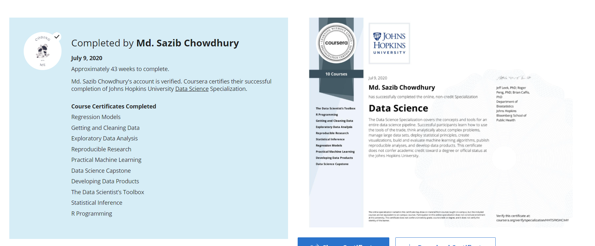

  <div align="center">
  
# Data-Science-Specialization-Johns-Hopkins-University

```
  
 Data Science Specialization 🐱‍👤🔢

```
  </div>
  
* * *
A ten-course introduction to data science, developed and taught by leading professors.

```
1. The Data Scientist’s Toolbox
```
In this course you will get an introduction to the main tools and ideas in the data scientist's toolbox. The course gives an overview of the data, questions, and tools that data analysts and data scientists work with. There are two components to this course. The first is a conceptual introduction to the ideas behind turning data into actionable knowledge. The second is a practical introduction to the tools that will be used in the program like version control, markdown, git, GitHub, R, and RStudio.

```
2. R Programming
```

In this course you will learn how to program in R and how to use R for effective data analysis. You will learn how to install and configure software necessary for a statistical programming environment and describe generic programming language concepts as they are implemented in a high-level statistical language. The course covers practical issues in statistical computing which includes programming in R, reading data into R, accessing R packages, writing R functions, debugging, profiling R code, and organizing and commenting R code. Topics in statistical data analysis will provide working examples.

```
3. Getting and Cleaning Data
```

Before you can work with data you have to get some. This course will cover the basic ways that data can be obtained. The course will cover obtaining data from the web, from APIs, from databases and from colleagues in various formats. It will also cover the basics of data cleaning and how to make data “tidy”. Tidy data dramatically speed downstream data analysis tasks. The course will also cover the components of a complete data set including raw data, processing instructions, codebooks, and processed data. The course will cover the basics needed for collecting, cleaning, and sharing data.

```
4. Exploratory Data Analysis
```

This course covers the essential exploratory techniques for summarizing data. These techniques are typically applied before formal modeling commences and can help inform the development of more complex statistical models. Exploratory techniques are also important for eliminating or sharpening potential hypotheses about the world that can be addressed by the data. We will cover in detail the plotting systems in R as well as some of the basic principles of constructing data graphics. We will also cover some of the common multivariate statistical techniques used to visualize high-dimensional data.

```
5. Reproducible Research
```

This course focuses on the concepts and tools behind reporting modern data analyses in a reproducible manner. Reproducible research is the idea that data analyses, and more generally, scientific claims, are published with their data and software code so that others may verify the findings and build upon them.  The need for reproducibility is increasing dramatically as data analyses become more complex, involving larger datasets and more sophisticated computations. Reproducibility allows for people to focus on the actual content of a data analysis, rather than on superficial details reported in a written summary. In addition, reproducibility makes an analysis more useful to others because the data and code that actually conducted the analysis are available. This course will focus on literate statistical analysis tools which allow one to publish data analyses in a single document that allows others to easily execute the same analysis to obtain the same results.

```
6. Statistical Inference
```

Statistical inference is the process of drawing conclusions about populations or scientific truths from data. There are many modes of performing inference including statistical modeling, data oriented strategies and explicit use of designs and randomization in analyses. Furthermore, there are broad theories (frequentists, Bayesian, likelihood, design based, …) and numerous complexities (missing data, observed and unobserved confounding, biases) for performing inference. A practitioner can often be left in a debilitating maze of techniques, philosophies and nuance. This course presents the fundamentals of inference in a practical approach for getting things done. After taking this course, students will understand the broad directions of statistical inference and use this information for making informed choices in analyzing data.

```
7. Regression Models
```

Linear models, as their name implies, relates an outcome to a set of predictors of interest using linear assumptions.  Regression models, a subset of linear models, are the most important statistical analysis tool in a data scientist’s toolkit. This course covers regression analysis, least squares and inference using regression models. Special cases of the regression model, ANOVA and ANCOVA will be covered as well. Analysis of residuals and variability will be investigated. The course will cover modern thinking on model selection and novel uses of regression models including scatterplot smoothing.

```
8. Practical Machine Learning
```

One of the most common tasks performed by data scientists and data analysts are prediction and machine learning. This course will cover the basic components of building and applying prediction functions with an emphasis on practical applications. The course will provide basic grounding in concepts such as training and tests sets, overfitting, and error rates. The course will also introduce a range of model based and algorithmic machine learning methods including regression, classification trees, Naive Bayes, and random forests. The course will cover the complete process of building prediction functions including data collection, feature creation, algorithms, and evaluation.

```
9. Developing Data Products
```

A data product is the production output from a statistical analysis. Data products automate complex analysis tasks or use technology to expand the utility of a data informed model, algorithm or inference. This course covers the basics of creating data products using Shiny, R packages, and interactive graphics. The course will focus on the statistical fundamentals of creating a data product that can be used to tell a story about data to a mass audience.

```
10. Data Science Capstone
```
The capstone project class will allow students to create a usable/public data product that can be used to show your skills to potential employers. Projects will be drawn from real-world problems and will be conducted with industry, government, and academic partners.


